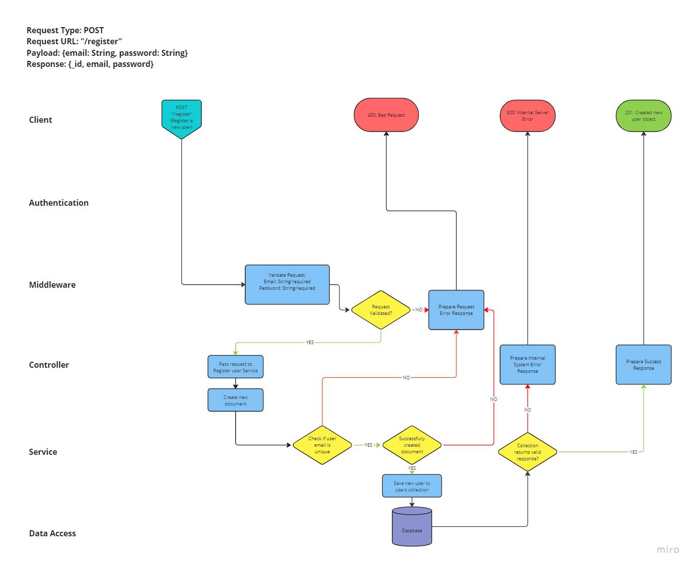

# Project Plan

## User Story (in Kanban Board)

## Routing Diagrams

### POST register new user

### POST authenticate user

### PUT update password

### POST get all favourites

### PATCH add favourite

### PATCH delete favourite

## Tests

### Unit: FavController tests

    getAllFavs tests
      ✔ should get all favs and returns them as json
      ✔ should send a 500 response if getAllFavs service throws an error
      ✔ should return an empty array if there are no favs
    addFav tests
      ✔ should add a fav
      ✔ should send a 400 status code when req.body is null
      ✔ should send a 500 status code when addFav service returns an error
    deleteFav tests
      ✔ should delete a fav
      ✔ should send a 400 status code when req.body is null
      ✔ should send a 500 status code when deleteFav service returns an error

### Unit: FavService tests

    getAllFavs tests
      ✔ should call getAllFavs in the Fav model
      ✔ should return the result of calling getAllFavs on the Fav model
      ✔ should return an empty array if there are no favs
    addFav tests
      ✔ should add new fav in the Fav model and returns the new fav
      ✔ should throw an error when save fails is added
      ✔ should throw an error when trying to add a duplicating fav
    deleteFav tests
      ✔ should delete a fav
      ✔ should return null if fav is not found
      ✔ should throw an error when findOneAndDelete fails

### Unit: FavValidator tests

    ✔ should return an array of middleware functions
    ✔ should include the handleValidationErrors method in the middleware array

### Unit: UserController tests

    registerUser tests
      ✔ should add a user
      ✔ should send a 400 status code when req.body is null
      ✔ should send a 400 status code when email is null
      ✔ should send a 400 status code when password is null
      ✔ should send a 500 status code when registerUser service returns an error
    authenticateUser tests
      ✔ should authenticate a user
      ✔ should send a 401 status code when req.body is null
      ✔ should send a 401 status code when email is null
      ✔ should send a 401 status code when password is null
      ✔ should send a 500 status code when authenticateUser service returns an error
    updatePassword tests
      ✔ should update the password of a user
      ✔ should send a 400 status code when req.body is null
      ✔ should send a 400 status code when email is null
      ✔ should send a 400 status code when password is null
      ✔ should send a 500 status code when authenticateUser service returns an error

### Unit: UserService tests

    registerUser tests
      ✔ should call registerUser in the User model
      ✔ should add new user in the User model and returns the new user
      ✔ should throw an error when save fails is added
      ✔ should throw an error when trying to register a user with an existing email
    authenticateUser tests
      ✔ should call authenticateUser on the User model
      ✔ should return the result of calling authenticateUser on the User model
      ✔ should throw an error if user email is not found
      ✔ should throw an error if user password is not found
    updatePassword tests
      ✔ should call updatePassword and find and return the result when a valid email and updated password are provided
      ✔ should throw an error when update fails is added

### Unit: UserValidator tests

    ✔ should return an array of middleware functions
    ✔ should include the handleValidationErrors method in the middleware array

### Integration Tests

    POST requests to /register on UserRoutes
      ✔ should respond with a 201 status code when a valid user is sent
      ✔ should return the registered user
      ✔ should respond with a 400 status code when user is empty
      ✔ should respond with a 400 status code when password is empty
      ✔ should respond with a 400 status code when email is empty
      ✔ should respond with a 400 status code when email has already been registered
      ✔ should respond with a 400 status code when email is invalid
      ✔ should respond with a 400 status code when password is invalid

    POST requests to /login on UserRoutes
      ✔ should respond with a 200 status code
      ✔ should return the logged in user
      ✔ should respond with a 401 status code when user is not found
      ✔ should respond with a 401 status code when password is missing
      ✔ should respond with a 401 status code when email is missing

    POST requests to /password on UserRoutes
      ✔ should respond with a 200 status code when a valid user is sent
      ✔ should return the user and the updated password
      ✔ should respond with a 400 status code when user is empty
      ✔ should respond with a 400 status code when password is empty
      ✔ should respond with a 400 status code when new password is invalid

    GET requests to /fav on FavRoutes
      ✔ should respond with a 200 status code for a GET requests to /fav
      ✔ should respond with an array of favs
      ✔ should respond with the correct favs for GET /fav
      ✔ should return a 200 status if the database has no favs

    POST requests to /fav on FavRoutes
      ✔ should respond with a 201 status code when a valid favourite is sent
      ✔ should return the added favourite
      ✔ should respond with a 400 status code when favourite is empty
      ✔ should respond with a 400 status code when favourite has already been added

    DELETE requests to /fav on FavRoutes
      ✔ should respond with a 200 status code when a valid favourite is sent
      ✔ should return the deleted favourite
      ✔ should respond with a 400 status code when favourite is empty
      ✔ should respond with a 400 status code when favourite is not found
