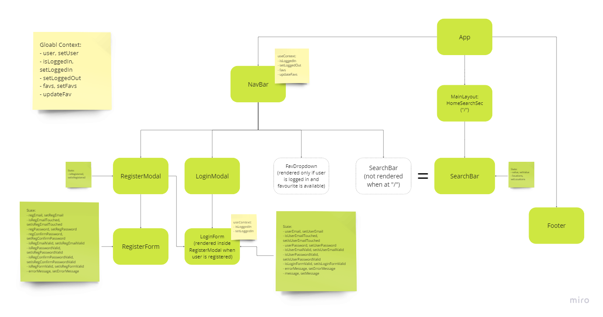
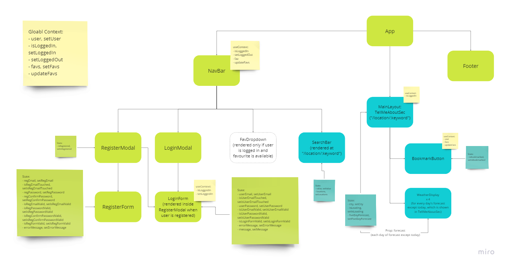

# Project Planning

## User Stories and Kanban Board

## Component Hierarchy

### Home Page ("/"):

### Tell Me About Page ("/location/:keyword"):

### Favourites Page ("/fav"):

## Tests Conducted

BookmarkButton component tests
- [x] renders remove bookmark button when city is already bookmarked
- [x] renders add bookmark button when city is not bookmarked

FavDropdown component tests
- [x] renders dropdown items when there are favourites

Footer component tests
- [x] renders footer correctly

LoginForm tests
- [x] updates userEmail state on input change
- [x] updates userPassword state on input change
- [x] applies 'is-invalid' class to input fields with invalid values

LoginModal component tests
- [x] renders modal correctly

NavBar tests
- [x] renders 'Home', 'Register' and 'Login' buttons but not 'Logout' button when user is not logged in
- [x] renders 'Home' and 'Logout' buttons but not 'Register' and 'Login' buttons when user is logged in

RegisterForm tests
- [x] updates isRegEmailValid state on input change
- [x] updates isRegPasswordValid state on input change
- [x] updates isRegConfirmPasswordValid state on input change
- [x] applies 'is-invalid' class to input fields with invalid values

RegisterModal component tests
- [x] renders modal correctly

SearchBar component tests
- [x] renders search input box correctly

WeatherDisplay component tests
- [x] renders weather data correctly

External user data tests
registerUser tests
- [x] should call axios.post once with supplied URL
- [x] should return 201 status when valid data is sent
- [x] should return an error object with provided error message
loginUser tests
- [x] should call axios.post once with supplied URL
- [x] should return 200 status when valid data is sent
- [x] should return an error object with provided error message
getAllFavs tests
- [x] should call axios.post once with supplied URL
- [x] should return an array of favourites when valid data is sent
- [x] should return an error object with provided error message
addFav tests
- [x] should call axios.patch once with supplied URL
- [x] should return a 201 status when valid data is sent
- [x] should return an error object with provided error message
deleteFav tests
- [x] should call axios.patch once with supplied URL
- [x] should return a 200 status when valid data is sent
- [x] should return an error object with provided error message